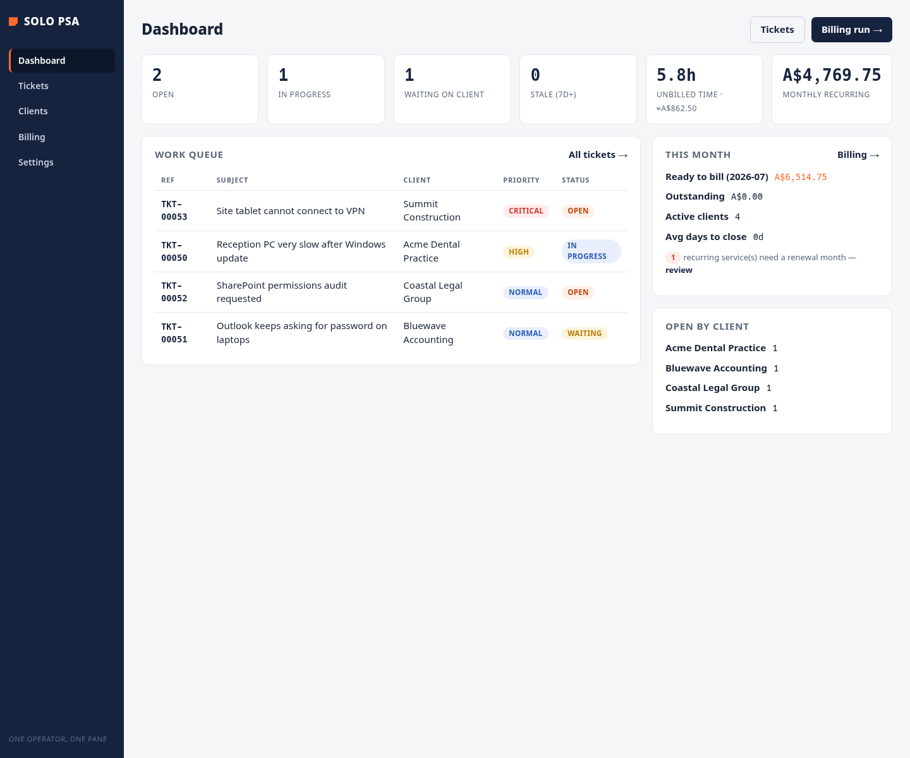
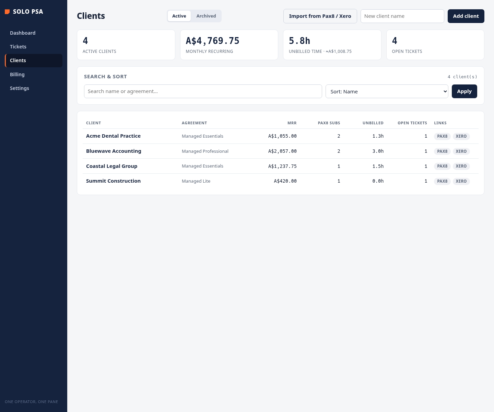
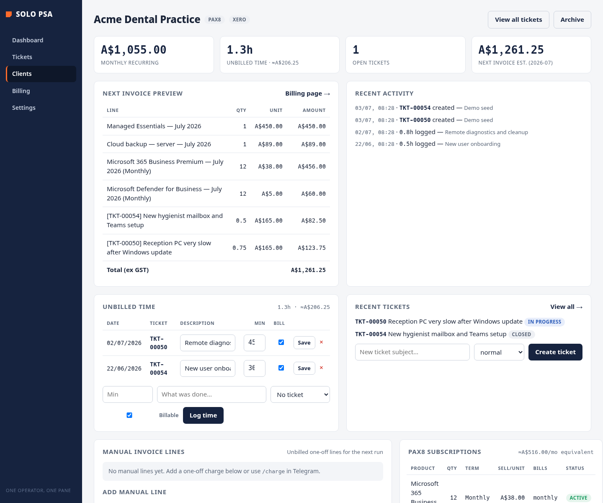
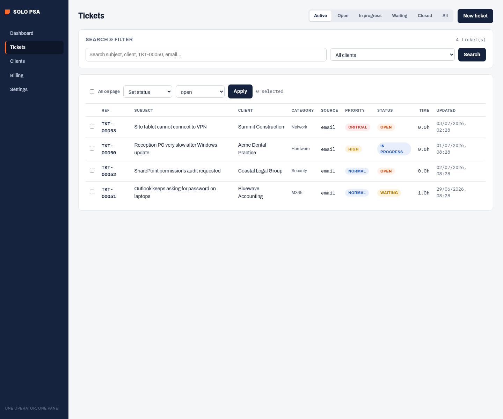
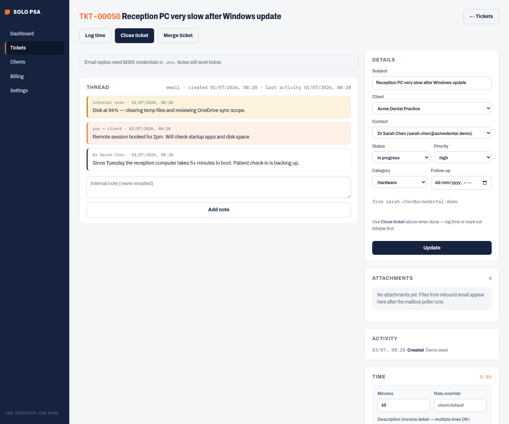
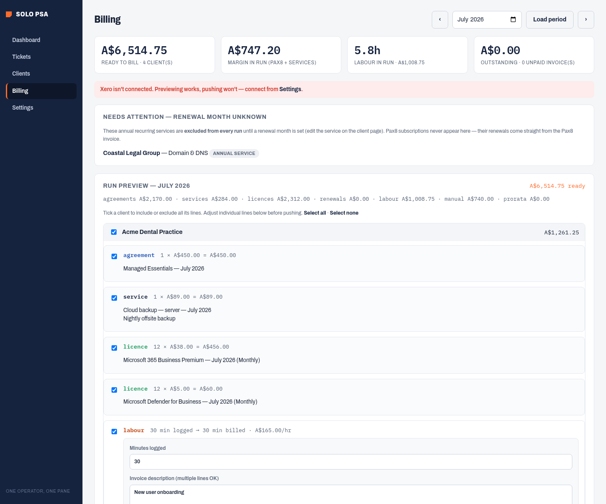
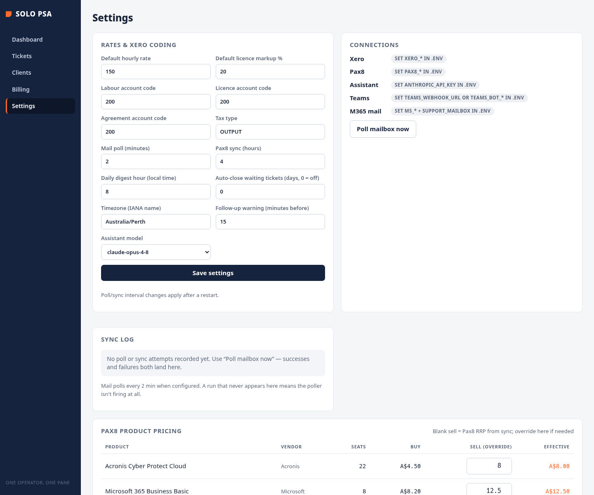

# Solo PSA

A single-operator MSP practice management app. Manage clients and contacts, run a helpdesk with M365 email-to-ticket (or manual tickets), sync Pax8 subscriptions, and push monthly billing to **Xero draft invoices** for review.

Built for one person running an MSP: one Node process, one SQLite file, no build step.



## Features

### Dashboard
At-a-glance view of open tickets, follow-ups, unbilled time, monthly recurring revenue (MRR), and who's ready to bill this month.

### Clients
Track client agreements, hourly rates, contacts, recurring services, Pax8 subscriptions, manual charges, and uninvoiced time. Import clients from Pax8 or Xero.





### Ticketing
Email-to-ticket via Microsoft 365, or create tickets manually. Reply from the app, add internal notes, log time, set follow-ups, attach files, and merge duplicates. Statuses: open, in progress, waiting, closed.





### Billing
Each month, build invoices per client from:

1. **Agreement** — flat monthly fee
2. **Licences** — active Pax8 subscriptions at your sell price
3. **Recurring services** — hosting, backup, domains, etc.
4. **Labour** — billable time, rounded to 15-minute blocks
5. **Manual charges** — one-off lines
6. **Prorata** — Pax8 draft-invoice prorata items

Preview the run, untick lines, then push. Invoices land in Xero as **DRAFT** — nothing is approved or emailed until you do it in Xero.



### Settings & integrations
Configure rates, Xero account codes, Pax8 product pricing, sync schedules, and connect optional integrations (Xero, Pax8, M365 mail, Telegram, Teams, Claude assistant).



### Optional integrations

| Integration | What it does |
|-------------|--------------|
| **Xero** | OAuth connect; push draft invoices |
| **Pax8** | Sync companies, subscriptions, prorata items |
| **Microsoft 365** | Poll support mailbox → tickets; send replies |
| **Telegram** | Create tickets, log time, billing commands from chat |
| **Microsoft Teams** | Daily digest, follow-up nudges, interactive bot |
| **Claude** | Natural-language assistant on web, Telegram, and Teams |

All integrations are optional — the app runs without credentials so you can explore clients, tickets, and billing locally.

---

## Requirements

- **Node.js 22+** (uses built-in `node:sqlite`)
- npm

## Quick start

```bash
git clone https://github.com/yourusername/solo-psa.git
cd solo-psa
cp .env.example .env          # fill credentials as needed (all optional to boot)
npm install
npm run seed:demo             # load fictional demo data (optional)
npm start                     # http://localhost:3000
```

Development with auto-reload:

```bash
npm run dev
```

Set `APP_PASSWORD` in `.env` before exposing the app beyond localhost. Sessions last 7 days.

## Demo data

To reset the database and load fictional clients, tickets, subscriptions, and time entries for exploration or screenshots:

```bash
npm run seed:demo
```

This deletes the existing SQLite database and replaces it with demo data. **Do not run on a production database.**

Demo clients: Acme Dental Practice, Bluewave Accounting, Coastal Legal Group, Summit Construction.

## Configuration

Copy `.env.example` to `.env` and fill in the integrations you need:

| Variable | Purpose |
|----------|---------|
| `PORT` | HTTP port (default `3000`) |
| `DB_PATH` | SQLite file path (default `./psa.sqlite`) |
| `APP_PASSWORD` | Single-password login (recommended for production) |
| `APP_TIMEZONE` | Fallback timezone (Settings page overrides) |
| `XERO_*` | Xero OAuth app credentials |
| `PAX8_*` | Pax8 API client credentials |
| `MS_*` + `SUPPORT_MAILBOX` | M365 Graph app + support mailbox |
| `TELEGRAM_*` | Telegram bot token and allowed chat ID |
| `TEAMS_*` | Teams webhook and/or bot credentials |
| `ANTHROPIC_API_KEY` | Claude assistant for natural-language commands |

See `.env.example` for setup notes on each integration.

### Xero

1. Create a Web app at [developer.xero.com](https://developer.xero.com/app/manage)
2. Set redirect URI to `https://your-host/auth/xero/callback` (localhost default works for testing)
3. Add credentials to `.env`, restart, then **Settings → Connect Xero**
4. New apps need **Contacts** and **Invoices** scopes

### Pax8

1. Partner portal → Integrations → API client credentials
2. Add `PAX8_CLIENT_ID` / `PAX8_CLIENT_SECRET` to `.env`
3. **Settings → Sync Pax8 now** — companies auto-link to clients by name

### Microsoft 365 email-to-ticket

1. Entra app registration with `Mail.ReadWrite` and `Mail.Send` (application permissions, admin consent)
2. Scope to the support mailbox via ApplicationAccessPolicy (recommended)
3. Set `MS_TENANT_ID`, `MS_CLIENT_ID`, `MS_CLIENT_SECRET`, `SUPPORT_MAILBOX` in `.env`

Unread mail becomes tickets every 2 minutes (configurable). Replies thread by ticket reference or conversation ID.

### Telegram bot

```
/ticket Client | Subject here     → create ticket
/tickets                          → open ticket list
/time 50 45 Description             → log 45 minutes on TKT-00050
/charge Client | 450 | Description  → manual invoice line
/bill                               → preview this month's billing
/push                               → confirm and push Xero drafts
```

Plain English also works: *"Log 2 hours on Acme for printer fix"* or *"Charge Bluewave $450 for laptop setup"*.

---

## Project structure

```
src/
  server.js           # Entry point, cron jobs, routes
  db.js               # SQLite init and settings
  schema.sql          # Database schema
  billing.js          # Monthly billing engine
  routes/             # HTTP handlers (clients, tickets, billing, settings)
  integrations/       # Xero, Pax8, Graph, Telegram, Teams
views/                # EJS templates
public/               # CSS and client JS
scripts/seed-demo.js  # Demo data loader
deploy/               # systemd unit and update script
```

## Production deploy

See `deploy/psa.service` and `deploy/update.sh` for systemd deployment on Linux (LXC, VPS, etc.). Put the app behind a reverse proxy with HTTPS — Xero requires an HTTPS redirect URI outside localhost.

Backups: one SQLite file (`psa.sqlite` + WAL). Safe while running:

```bash
sqlite3 psa.sqlite ".backup psa-$(date +%F).sqlite"
```

## Tech stack

Node.js 22+, Express, EJS, SQLite (`node:sqlite`), node-cron. No native build step, no frontend bundler.

## License

MIT (or your chosen license)
